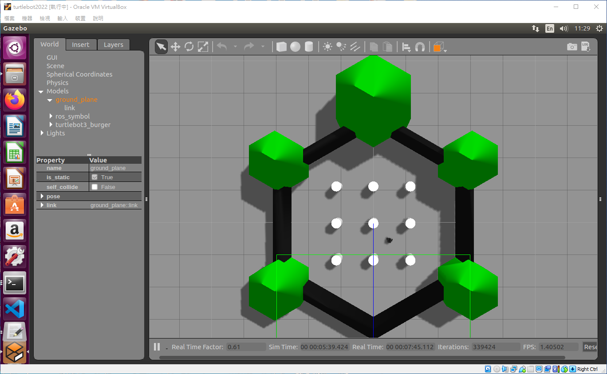
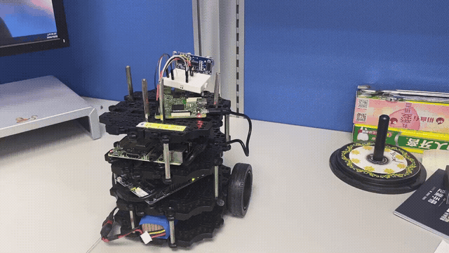

# TurtleBot3 ROS 2: Simulation to Real Deployment

**A hands-on robotics portfolio focused on ROS 2 implementation: Gazebo simulation, reusable nodes and interfaces, and deployment to a physical TurtleBot3.**

This project brings together robot bringup, LiDAR/camera integration, odometry, a safety-controlled velocity pipeline, and distributed ROS 2/DDS coordination. The core engineering idea is to keep the application interfaces consistent as Gazebo's simulated base and sensors are replaced by physical devices.

The walkthrough follows **simulation → shared ROS 2 application → physical deployment**, with ROS 2 implementation as the central focus. Five external communication methods support the robot application and are documented after the ROS 2 implementation and deployment sections.

## Results showcase

### Simulation — TurtleBot3 in Gazebo




### Physical — TurtleBot3 hardware demonstration



These assets show the simulation environment and physical robot. For the scope of software checks and runtime validation, see [VALIDATION.txt](VALIDATION.txt).

## ROS 2 implementation skills

| Capability | Implementation in this repository |
|---|---|
| ROS 2 application development | Python nodes for coordination, safety, sensor health, snapshots, and status aggregation |
| Custom topics and services | `RobotStatus`, `SetMode`, `SetFloat`, and `GetSnapshot` interfaces |
| Simulation integration | Gazebo launch composed with the same coordinator, safety, and status nodes, using simulation time |
| Sensor and actuator integration | LiDAR `/scan`, camera images, base `/odom`, and safety-gated `/cmd_vel` |
| Sim-to-real deployment design | Separate launch files for Motor, Sensor, Coordinator, and Communication Raspberry Pis |
| Runtime safety and verification | Velocity limits, stale-command and stale-scan stops, E-stop, mode gating, and pure-Python tests |
| Deployment operations | Workspace build script, ROS domain configuration, and example systemd units |

## 1. Simulation first — build and run in Gazebo

The source targets **ROS 2 Jazzy / Ubuntu 24.04**. On a ROS 2 machine with the TurtleBot3 Gazebo packages and ROS dependency tooling installed, build the workspace before launching:

```bash
cd ~/tb3_distributed_ws  # the directory containing this repository's src/
bash scripts/build_workspace.sh
source install/setup.bash
python3 -m pip install -r requirements-optional.txt
python3 -m pip install -r operator/requirements.txt
```

Gazebo supplies the robot base and sensors. The launch file starts the application coordinator, safety supervisor, status aggregator, sensor health, optional camera snapshot helper, and communication bridges. Bluetooth is disabled in simulation.

### Launch the simulation

For the full camera-enabled pipeline, start with Waffle Pi:

```bash
export TURTLEBOT3_MODEL=waffle_pi
ros2 launch tb3_distributed_bringup simulation.launch.py \
  model:=waffle_pi \
  world:=world \
  start_comm:=true \
  enable_camera_helpers:=true
```

Then in another terminal:

```bash
python3 operator/operator_console.py --host 127.0.0.1
```

If your installed TurtleBot3 simulation publishes the camera under a different topic, inspect:

```bash
ros2 topic list | grep -i camera
```

and launch with:

```bash
ros2 launch tb3_distributed_bringup simulation.launch.py \
  camera_topic:=<YOUR_CAMERA_IMAGE_TOPIC>
```

The intended sim-to-real equivalence is:

```text
SIMULATION                           PHYSICAL
Gazebo /scan                        LDS /scan
Gazebo camera                       physical camera
Gazebo base                         OpenCR + motors
        │                                  │
        └──── same ROS 2 interfaces ───────┘
                 /scan
                 /odom
                 /cmd_vel
                 /robot/status
                 /camera/take_snapshot
```

### What carries over to the real robot?

| Layer | Simulation | Physical deployment |
|---|---|---|
| Base and odometry | Gazebo TurtleBot3 | TurtleBot3 base driver and OpenCR on Motor Pi |
| LiDAR and camera | Simulated sensor topics | LDS driver and camera on Sensor Pi |
| Application logic | Coordinator, safety, and status nodes | Same application nodes on Coordinator Pi |
| Time | `use_sim_time:=true` | Wall clock (`use_sim_time:=false` by default) |
| Operator interface | Local host for a single-machine simulation | Communication Pi network address |

Moving to hardware requires configuring the model, serial ports, sensor topics, ROS domain, and network discovery, then repeating the safety checks below. The shared interfaces reduce application changes; hardware integration still needs runtime verification.


## 2. Shared ROS 2 implementation

### Packages

#### `tb3_distributed_interfaces`
Custom interfaces used between the distributed nodes.

- `msg/RobotStatus.msg`
- `srv/GetSnapshot.srv`
- `srv/SetFloat.srv`
- `srv/SetMode.srv`

#### `tb3_distributed_core`
Runtime nodes:

- `udp_bridge` — UDP latest-value velocity -> ROS 2 topic
- `tcp_bridge` — reliable TCP JSON command -> ROS 2 service -> ACK
- `zmq_bridge` — ROS 2 status -> ZeroMQ PUB telemetry
- `rest_api` — REST status/snapshot resources
- `bluetooth_bridge` — local RFCOMM maintenance interface
- `safety_supervisor` — fail-closed velocity gate
- `system_coordinator` — application mode (`TELEOP`, `IDLE`, `MAINTENANCE`)
- `status_aggregator` — builds one `/robot/status`
- `sensor_health` — LiDAR/camera liveness
- `snapshot_server` — ROS 2 on-demand JPEG snapshot service

#### `tb3_distributed_bringup`
Launch files for the four Raspberry Pis and Gazebo simulation.

### ROS 2 graph

#### Topics

| Topic | Type | Producer | Consumer / use |
|---|---|---|---|
| `/teleop/cmd_vel_raw` | `geometry_msgs/TwistStamped` | UDP bridge | safety supervisor |
| `/cmd_vel` | `geometry_msgs/TwistStamped` | safety supervisor | TurtleBot3 base |
| `/scan` | `sensor_msgs/LaserScan` | Sensor Pi / simulation | safety supervisor + sensor health |
| `/camera/image_raw` | `sensor_msgs/Image` | Sensor Pi / simulation | snapshot server + sensor health |
| `/odom` | `nav_msgs/Odometry` | Motor Pi / simulation | status aggregator |
| `/battery_state` | `sensor_msgs/BatteryState` | TurtleBot3 base if available | status aggregator |
| `/robot/mode` | `std_msgs/String` | coordinator | safety + status |
| `/robot/status` | `RobotStatus` | status aggregator | ZMQ / REST / Bluetooth |
| `/safety/reason` | `std_msgs/String` | safety supervisor | status aggregator |
| `/safety/front_distance` | `std_msgs/Float32` | safety supervisor | status aggregator |
| `/safety/min_distance` | `std_msgs/Float32` | safety supervisor | status aggregator |
| `/health/lidar` | `std_msgs/Bool` | Sensor Pi | status aggregator |
| `/health/camera` | `std_msgs/Bool` | Sensor Pi | status aggregator |

#### Services

| Service | Type | Purpose |
|---|---|---|
| `/robot/set_mode` | `SetMode` | reliable high-level mode switch |
| `/safety/set_max_speed` | `SetFloat` | reliable runtime velocity limit |
| `/safety/set_estop` | `std_srvs/SetBool` | reliable E-stop / clear |
| `/camera/take_snapshot` | `GetSnapshot` | return JPEG bytes on demand |

## 3. Safety-controlled motion

The operator never publishes directly to `/cmd_vel`.

```text
Operator UDP velocity
        │
        ▼
/teleop/cmd_vel_raw
        │
        ▼
┌───────────────────────────┐
│ Safety Supervisor         │◄──── /scan
│                           │◄──── /robot/mode
│ - obstacle radius         │◄──── E-stop service/topic
│ - command timeout         │
│ - scan timeout            │
│ - velocity clamp          │
│ - fail closed             │
└─────────────┬─────────────┘
              │
              ▼
          /cmd_vel
              │
              ▼
        TurtleBot3 base
```

Default safety rules:

- obstacle distance `< 0.35 m` -> output zero velocity
- no new operator command for `> 0.50 s` -> zero velocity
- no LiDAR update for `> 0.50 s` -> zero velocity
- E-stop engaged -> zero velocity
- robot mode is not `TELEOP` -> zero velocity
- requested velocity is clamped to the configured platform limit

The implementation is intentionally conservative: **any valid LiDAR return inside the protected radius blocks operator motion**, matching the original project requirement. A separate front-sector distance is computed for operator feedback.

## 4. Physical deployment

### Distributed architecture

```text
                           OPERATOR COMPUTER
┌─────────────────────────────────────────────────────────────────────┐
│ Keyboard / joystick                                                 │
│   └─ UDP 20 Hz velocity + heartbeat ───────────────────────────┐    │
│                                                                │    │
│ Reliable controls                                              │    │
│   └─ TCP: mode / max-speed / E-stop + ACK ────────────────┐    │    │
│                                                           │    │    │
│ Dashboard                                                 │    │    │
│   └─ ZeroMQ SUB: status / pose / distance / safety ◄──────┼────┼────┤
│                                                           │    │    │
│ Resource requests                                         │    │    │
│   └─ REST: GET /api/status, GET /api/snapshot ◄───────────┼────┼────┤
└───────────────────────────────────────────────────────────┼────┼────┘
                                                            │    │
                                                       Wi-Fi/Ethernet
                                                            │    │
                                                            ▼    ▼
                                               COMMUNICATION RASPBERRY PI
                         ┌─────────────────────────────────────────────────────────┐
                         │ UDP bridge  ─────────────► /teleop/cmd_vel_raw         │
                         │ TCP bridge  ─────────────► ROS 2 services              │
                         │ ZMQ bridge  ◄───────────── /robot/status               │
                         │ REST bridge ◄───────────── /robot/status + snapshot srv│
                         │ Bluetooth  ◄────────────── local maintenance           │
                         └───────────────────────┬─────────────────────────────────┘
                                                 │ ROS 2 DDS
                    ┌────────────────────────────┼───────────────────────────────┐
                    │                            │                               │
                    ▼                            ▼                               ▼
             SENSOR PI                    COORDINATOR PI                    MOTOR PI
       ┌──────────────────┐          ┌───────────────────────┐        ┌──────────────────┐
       │ LiDAR -> /scan   │          │ system_coordinator    │        │ turtlebot3_node  │
       │ Camera -> image  │          │ safety_supervisor     │        │ /odom            │
       │ sensor_health    │          │ status_aggregator     │        │ OpenCR serial    │
       │ snapshot_server  │          │                       │        └────────┬─────────┘
       └────────┬─────────┘          └───────────┬───────────┘                 │
                │                                │                             ▼
                └──────── ROS 2 DDS ─────────────┴────────────────────────── OpenCR
                                                 │                             │
                                                 │ /cmd_vel                    ▼
                                                 └────────────────────────── Motors
```

A technician can additionally connect **locally** to the Communication Pi over Bluetooth RFCOMM for commissioning/diagnostics. Bluetooth is not the normal teleoperation path.

ROS 2/DDS is the common internal bus. Each robot-side Raspberry Pi runs ROS 2 nodes in the same ROS domain; there is no central ROS 2 master.

### Baseline platform

The project targets ROS 2 Jazzy / Ubuntu 24.04. TurtleBot3 Jazzy uses `TwistStamped` for `/cmd_vel` by default, which is why the project uses `geometry_msgs/TwistStamped` end-to-end.

All Raspberry Pis should use the same ROS domain, e.g.:

```bash
export ROS_DOMAIN_ID=30
export ROS_LOCALHOST_ONLY=0
```

Put these in `~/.bashrc` on every robot-side Raspberry Pi.

The machines must be able to discover each other on the LAN. If a managed Wi-Fi network blocks multicast/discovery, use a network that permits ROS 2 discovery or configure your DDS discovery strategy explicitly.

### Build on each Raspberry Pi

Place this project at for example:

```text
/home/ubuntu/tb3_distributed_ws/
```

Install ROS/TurtleBot3 dependencies, then:

```bash
cd ~/tb3_distributed_ws
./scripts/build_workspace.sh
source install/setup.bash
```

Communication Pi Python extras:

```bash
python3 -m pip install -r requirements-optional.txt
```

Sensor Pi camera extras on Jazzy typically include:

```bash
sudo apt install ros-jazzy-v4l2-camera ros-jazzy-cv-bridge python3-opencv
```

### Launch the four Raspberry Pis

#### Motor Pi

```bash
export TURTLEBOT3_MODEL=burger
ros2 launch tb3_distributed_bringup motor_pi.launch.py \
  model:=burger usb_port:=/dev/ttyACM0
```

This Pi owns the TurtleBot3 base/OpenCR interface and publishes odometry.

#### Sensor Pi

```bash
ros2 launch tb3_distributed_bringup sensor_pi.launch.py \
  lds_model:=LDS-02 \
  lidar_port:=/dev/ttyUSB0 \
  enable_camera:=true \
  camera_topic:=/camera/image_raw
```

This Pi owns the LiDAR/camera, sensor health, and on-demand snapshot service.

#### Coordinator Pi

```bash
ros2 launch tb3_distributed_bringup coordinator_pi.launch.py
```

This runs the application coordinator, fail-closed safety gate, and status aggregator.

#### Communication Pi

```bash
ros2 launch tb3_distributed_bringup comm_pi.launch.py \
  enable_udp:=true \
  enable_tcp:=true \
  enable_zmq:=true \
  enable_rest:=true \
  enable_bluetooth:=true
```

If Bluetooth is not configured yet, use `enable_bluetooth:=false`.

### Verify the physical ROS 2 system

From any Pi in the ROS domain:

```bash
ros2 node list
ros2 topic list
ros2 topic echo /robot/status
ros2 service list
```

Expected nodes include roughly:

```text
/safety_supervisor
/system_coordinator
/status_aggregator
/udp_command_bridge
/tcp_reliable_command_bridge
/zmq_telemetry_bridge
/rest_api_bridge
/sensor_health
/snapshot_server
/turtlebot3_node
```

Before driving, verify safety manually:

1. With no UDP command, `/safety/reason` should become `COMMAND_TIMEOUT`.
2. Put an obstacle within 0.35 m; it should become `OBSTACLE_TOO_CLOSE` and `/cmd_vel` should be zero.
3. Stop the LiDAR stream; it should fail closed with `SCAN_TIMEOUT`.
4. Send TCP E-stop; `/cmd_vel` must remain zero until cleared.
5. Set mode to `IDLE`; operator velocity commands must be rejected.

### Run as system services

Example units are in `deploy/systemd/` for Motor, Sensor, Coordinator, and Communication Pis. Adjust usernames, paths, TurtleBot3 model, device ports, and whether Bluetooth should be enabled before installing them.

## 5. Operator workflow

The operator computer does **not** need ROS 2.

Install only ZeroMQ support:

```bash
cd operator
python3 -m pip install -r requirements.txt
```

Run the full operator console:

```bash
python3 operator/operator_console.py --host <COMMUNICATION_PI_IP>
```

Controls:

```text
W/S/A/D     UDP movement
SPACE       UDP stop

E           TCP E-stop
C           TCP clear E-stop
M           TCP toggle TELEOP/IDLE
1/2/3       TCP max speed presets (0.08 / 0.14 / 0.22 m/s)

T           show latest ZeroMQ telemetry
I           REST GET /api/status
P           REST camera snapshot -> operator/snapshots/

Q           quit; sends final zero-velocity UDP packets
```

For local Bluetooth maintenance on Linux:

```bash
python3 operator/bluetooth_maintenance_client.py --address AA:BB:CC:DD:EE:FF
```

## 6. Verification

Pure Python unit tests cover the safety decision layer and wire-protocol validation without requiring ROS 2:

```bash
pytest -q tests
```

Current test set checks:

- clear velocity path
- obstacle override
- command timeout
- scan timeout
- E-stop priority
- mode gate
- LiDAR range filtering
- front-sector distance
- UDP clamping/sequence parsing
- TCP command validation
- rejection of motion commands on the TCP reliable-control channel

For end-to-end validation, repeat the obstacle, command-timeout, scan-timeout, E-stop, and mode-gate checks from the physical verification section in both Gazebo and on hardware. Unit tests exercise decision logic and protocol parsing; they do not establish DDS discovery, driver compatibility, or real-world stopping behavior.

## 7. Supporting communication methods

The five channels have distinct roles around the ROS 2 application:

| Channel |Role | Examples |
|---|---|---|
| **UDP** | real-time latest-value control | velocity commands, 20 Hz heartbeat |
| **TCP** | reliable discrete control + ACK | set mode, set max speed, E-stop / clear E-stop |
| **ZeroMQ** | asynchronous telemetry PUB/SUB | pose, distance, battery, safety, health |
| **REST API** | on-demand resources | full status JSON, camera snapshot JPEG |
| **Bluetooth RFCOMM** | local commissioning / diagnostics | get IP, test LiDAR/camera/motor health, local E-stop |

See also [protocol matrix](docs/PROTOCOL_MATRIX.md) and [data flows](docs/DATA_FLOWS.md).

## 8. External protocol reference

### UDP — real-time control

Default port: `5005/udp`

Operator continuously sends the latest desired velocity, normally at 20 Hz:

```json
{"linear_x":0.12,"angular_z":0.0,"seq":481,"wall_time":1791175201.32}
```

`seq` lets the robot reject stale/out-of-order datagrams. The safety supervisor independently applies a command timeout, so loss of the operator stream stops the robot.

### TCP — reliable command + ACK

Default port: `5006/tcp`, newline-delimited JSON.

Examples:

```json
{"command":"set_mode","mode":"TELEOP","request_id":1}
{"command":"set_max_speed","value":0.14,"request_id":2}
{"command":"set_estop","engaged":true,"request_id":3}
{"command":"set_estop","engaged":false,"request_id":4}
{"command":"ping","request_id":5}
```

The TCP bridge does not ACK merely because bytes arrived. It waits for the corresponding ROS 2 service result, then returns for example:

```json
{"ok":true,"command":"set_max_speed","message":"max linear speed set to 0.140 m/s","request_id":2}
```

### ZeroMQ — continuous telemetry

Default endpoint: `tcp://ROBOT_IP:5555`, PUB/SUB.

Published topics:

- `robot.status` — complete status JSON
- `robot.pose` — x/y/yaw
- `robot.distance` — front/min distance
- `robot.safety` — blocked/reason/E-stop
- `robot.health` — battery + LiDAR/camera/motor health

This is the continuous asynchronous feedback path; the operator does not need to poll the robot.

### REST — on-demand resources

Default port: `8000/tcp`.

- `GET /api/health`
- `GET /api/status`
- `GET /api/config`
- `GET /api/snapshot?quality=85` -> JPEG image bytes

The photo path is deliberately request/response rather than continuous streaming:

```text
Operator REST request
      -> Communication Pi REST node
      -> ROS 2 /camera/take_snapshot service
      -> Sensor Pi snapshot_server
      -> latest /camera/image_raw frame
      -> JPEG bytes over ROS 2 service
      -> HTTP image/jpeg response
      -> Operator saves/displays photo
```

### Bluetooth — local commissioning / diagnostics

RFCOMM channel `1` by default. Text commands:

```text
HELP
PING
GET_IP
GET_STATUS
TEST_LIDAR
TEST_CAMERA
TEST_MOTOR
ESTOP
CLEAR_ESTOP
```

This path is intended for a nearby engineer, initial setup, network troubleshooting, and diagnostics. It is not the normal driving interface.

## 9. Engineering summary

> My focus is implementing a ROS 2 robot application that can span simulation and physical deployment. I use custom topics and services to connect sensor processing, mode coordination, telemetry, and a fail-closed velocity supervisor. Gazebo supplies the simulated base and sensors; hardware launch files connect the application to the TurtleBot3 base, LiDAR, and camera across Raspberry Pis using ROS 2/DDS. The deployment workflow checks the same command path and safety conditions in both environments. UDP, TCP, ZeroMQ, REST, and Bluetooth are supporting integration interfaces around that ROS 2 application.
